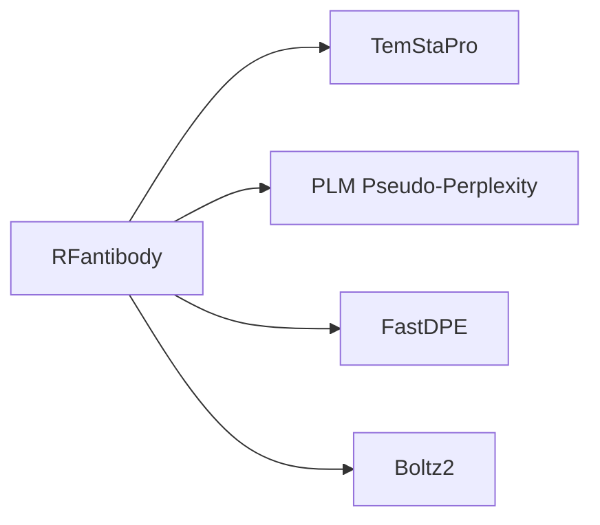
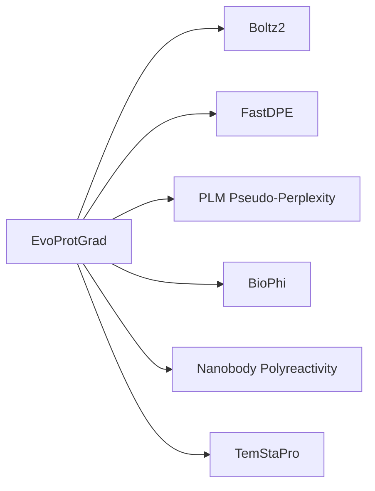
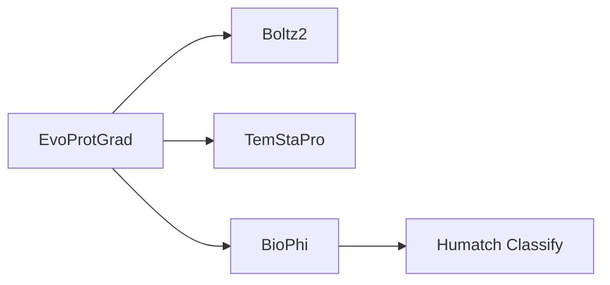
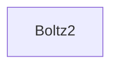
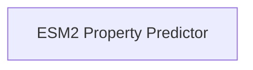

# Design note: storing recipe topology (deferred)

**Status: DEFERRED.** This documents the gap and the modeling challenge; it is not implemented.
A recipe's *wiring* is not captured anywhere in AffinityLog yet — the honest "one gild too far"
for this phase (see also `schema-stress-log.md`).

## The gap, precisely

A Bio Discovery **recipe is a directed acyclic graph (DAG)**: nodes are module instances, edges are
data-flow connections from one module's typed **output port** to another's **input port** (e.g.
`EvoProtGrad.designResults → BioPhi.antibodySequences`, then `BioPhi.humanizedSequences →
HumatchClassify.antibodySequences`).

What we store today (`recipe_modules`, a pure `(recipe_id, module_id)` M2M) is the **node set only** —
membership. It loses:
- **the edges** (which output feeds which input) — the actual recipe;
- **ports** (a module has several typed inputs/outputs; connections are port-to-port, and Bio Discovery
  validates compatibility — "guide you away from connections that can't perform at run");
- **per-instance config** at the node (the Input Parameters — those we *do* capture separately, via the
  HTML scraper / `INPUT_PARAMETERS.md`).

Helpful simplifier: Bio Discovery **enforces one instance of a module per recipe** (learned the hard way,
schema-stress-log). So module identity *is* node identity — no duplicate nodes, and `recipe_modules`
already is a faithful node set. The missing piece is purely the **edges**.

## Why it matters (this isn't cosmetic)

Nearly every emergent behavior we spent the corpus decoding traces directly to the wiring:
- Boltz2 wired to EvoProtGrad's *design* branch → it folds designs, not the BioPhi-humanized derivatives
  → **that is why humanized candidates have no structure.**
- Humatch wired to *BioPhi's* output → it scores the humanized row → the **design→humanized partition**.
- A **disconnected** Boltz2 (Exp 7/8/11) behaves completely differently from a wired one.

So "which candidate carries which scores / structures" — the shape of the whole dataset — *is* the recipe
topology. Storing modules-without-edges throws away the explanation for the data's structure.

## Modeling options (the recurring normalized-vs-JSONB tension, again)

1. **Edge table** — `recipe_edges(from_module_id, from_port, to_module_id, to_port)`. Fully normalized;
   enables topology queries ("which recipes feed BioPhi into Humatch?") and graph traversal. Cost: a real
   graph schema in SQL, and ports need their own vocabulary/catalog.
2. **JSONB graph blob** — a `recipes.graph` column holding `{nodes, edges}`. Mirrors how the UI serializes
   the canvas, round-trips losslessly, trivial to store. Cost: opaque to SQL (same trade as `scores` JSONB
   — storage stays dumb, a resolver supplies meaning).
3. **Hybrid (recommended).** Keep `recipe_modules` for queryable membership ("which recipes use module X"),
   add JSONB wiring for the exact DAG. Best of both, and consistent with this project's through-line —
   *store the structure, resolve the view* ("GraphQL is the apparent representation").

## Two wrinkles a real implementation must handle

- **Recipes drift.** We already saw versioned copies — "HER2 Round 2 Again-copy-4", "HER2 Round 3 take 1",
  "Boltz2 Solo", "ESM2 Only". A recipe can be re-wired after an experiment ran. So an `Experiment` should
  **snapshot the recipe graph as it was at run time** (immutable), not just FK a mutable `Recipe` that may
  later change — same frozen-snapshot logic as Alembic migrations and `Experiment.params`.
- **Capture is easy — this REVERSES the note's original assumption (checked 2026-07-17).** The recipe
  canvas is **React Flow (xyflow)**, which renders the graph to accessible DOM: nodes as
  `class="react-flow__node" data-id="<module>"`, edges as `aria-label="Edge from <src> to <tgt>"`. So the
  wiring is *directly* scrapeable — arguably easier than the Input Parameters table. Proven by
  `scripts/scrape_input_parameters.py::scrape_recipe_dag` on the reference recipe below. (Port-level handles,
  `designResults → antibodySequences`, are a further refinement in the handle markup.) **So the deferral is
  a storage-modeling choice, not a capture blocker** — the "one gild too far" is the *storage*, not the grab.

## Recipe DAG catalog (all successful runs)

Every recipe's wiring, extracted from its saved diagram by `scrape_recipe_dag` (React Flow nodes +
edge `aria-label`s) and rendered as Mermaid (GitHub draws these natively).

### De Novo Design — Run 1

RFantibody designs; everything scores the design. **No humanization branch** → one candidate per
subexperiment, no design→humanized split.

### HER2 Round 2 Again-copy-4 — Run 9

EvoProtGrad evolves; six scorers hang off it. BioPhi humanizes but **nothing scores its output** → the
humanized row carries only BioPhi's own humanness.

### HER2 Round 3 take 1 — Exp 3, 5, 6 (most complex)

The only **two-level** DAG: BioPhi's humanized output feeds Humatch — which is why humanized rows in
Exp 3/5/6 carry Humatch scores. Deepest humanization branch in the corpus.

### Boltz2 Solo — Exp 8, 11

### ESM2 Only — Exp 9, 10

## The payoff: DAG depth predicts data shape

The humanization branch's depth *predicts* the design→humanized partition decoded from empty cells:
- **De Novo Design** — no BioPhi → no humanized row at all.
- **Round 2** — `EvoProtGrad → BioPhi` (depth 1) → humanized row scored by BioPhi only.
- **Round 3** — `EvoProtGrad → BioPhi → Humatch` (depth 2) → humanized row scored by BioPhi *and* Humatch.

Topology and data are the same fact from two directions. Every recipe's wiring is now captured and one
`scrape_recipe_dag` call from JSON — the **storage** modeling (above) is all that remains deferred.
