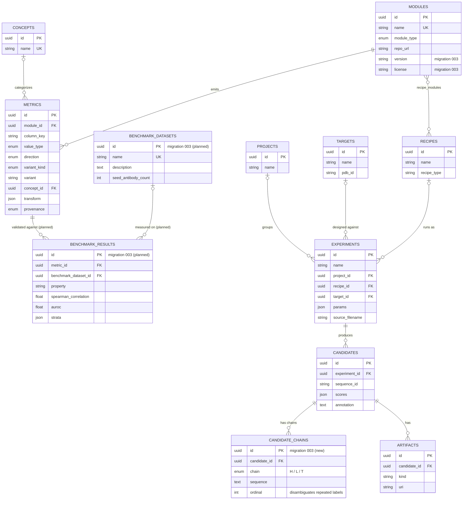
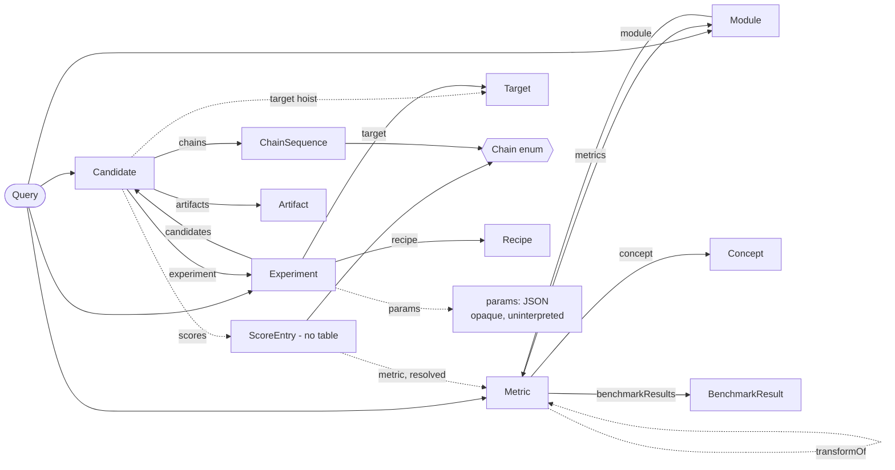

# AffinityLog — Schema: SQL ERD vs. GraphQL apparent representation

Two views of the same data, side by side:

- **SQL ERD** — how it's *stored* (normalized, integrity-first). `orm.py` + migrations `001`–`002`,
  plus what migration `003` adds (`BenchmarkDataset`, `BenchmarkResult`, `Module.version/license`,
  and now the `candidate_chains` child table — see below).
- **GraphQL** — how it's *served* (the "apparent representation" a consumer sees). Deliberately
  **not** a 1:1 mirror — see the divergence table at the bottom.

Both are the source of truth for their layer; the resolver is the seam that lets them differ.

> **Change (2026-07-04):** `Candidate.fasta_sequence` (one `/`-joined text blob) is replaced by a
> `candidate_chains` child table — one row per chain (H/L/T), because a candidate may have 0–many
> targets and 0–1 light chains depending on format (nanobody vs IgG/scFv vs protein-protein dock).
> Nothing about "nanobody" or "exactly one target" is baked in. See `docs/first-run-findings.md` §8.

## SQL — how it's stored

## GraphQL — how it's served (apparent representation)

Nodes = types, arrows = fields that reference another type. Dashed = a projection/edge with **no
backing FK** (synthesized by a resolver). `ScoreEntry` is the standout: **a type backed by no table
at all** — the resolver builds it per-query from a `scores` JSONB entry + a catalog `Metric` lookup.

**Convention:** this is an *edges-only* view — scalar fields (`id`, `tier`, `recommendation`,
`sequenceId`, `pdbId`, …) exist on every type but aren't drawn, since they aren't references. The
one scalar worth flagging is `Experiment.params` (the `[params: JSON]` node below): it's **present**
in the API, just **opaque** — a JSON blob we don't interpret, because (unlike `scores`, which has the
`Metric` catalog to resolve against) there's no param catalog yet. See the TODO in
`graphql-schema-handoff.md`. Note `scores` is *not* absent here — it's the `→ ScoreEntry` edge (the
interpreted projection); only its raw JSONB backing lives SQL-side.

## Where they diverge (and why)

| SQL (stored) | GraphQL (served) | Why |
|---|---|---|
| `candidates.scores` — one JSONB column | `Candidate.scores: [ScoreEntry]` | Flexible blob stored; interpreted list projected. `ScoreEntry` has no table. |
| `metrics` & `candidates` — no FK between them | `ScoreEntry.metric` resolves the link at query time | Resolver marries JSONB key ↔ catalog row; edge doesn't exist in SQL. |
| `candidate_chains` rows (H/L/T) | `Candidate.chains: [ChainSequence]` | Roughly 1:1 — the one place they nearly match. |
| candidate → experiment → target (2 FK hops) | `candidate.target` (1 hoisted field) | Apparent rep flattens the join into a convenience edge. |
| `recipe_modules` M:N (+ wiring) | `recipe.modules` only; DAG hidden | Arbitrary graphical wiring is stored, not surfaced. |
| every table full-CRUD | query-all + annotate-only mutation | Writes are REST (CSV import); GraphQL is reads + a sliver. |
| `experiments.params` JSONB | `Experiment.params: JSON` (opaque) | Per-recipe config varies wildly (De Novo vs Directed Evolution) — a bag, not columns. |

Full SDL sketch lives in the design discussion / `graphql-schema-handoff.md`; this file is the
picture. Renders on GitHub natively and in VS Code with any mermaid extension.
