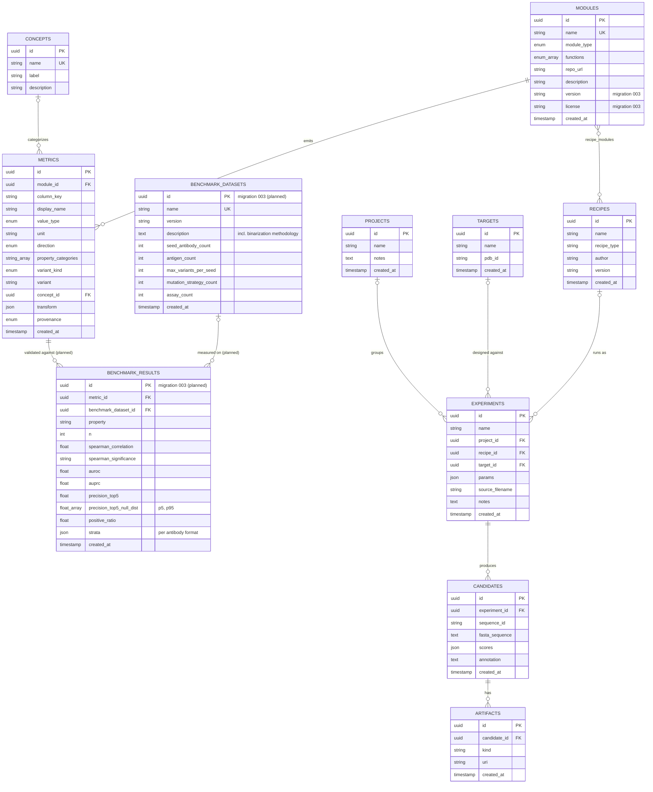

# AffinityLog — Schema ERD

Current schema (`app/models/orm.py`, migrations `001`–`002`) plus what migration `003` adds.
`BenchmarkDataset` and `BenchmarkResult` are **planned, not yet built** — see
`docs/catalog-seed-plan.md` and the `YOUR TURN` blocks in `orm.py`.

